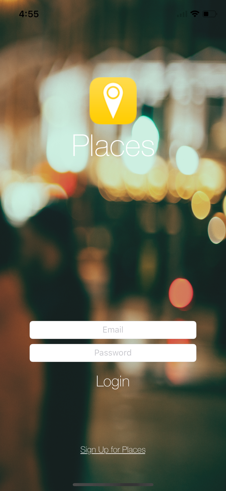
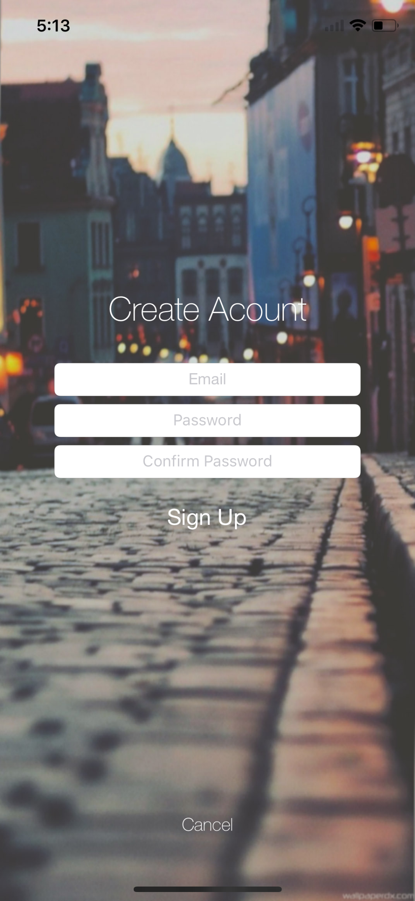
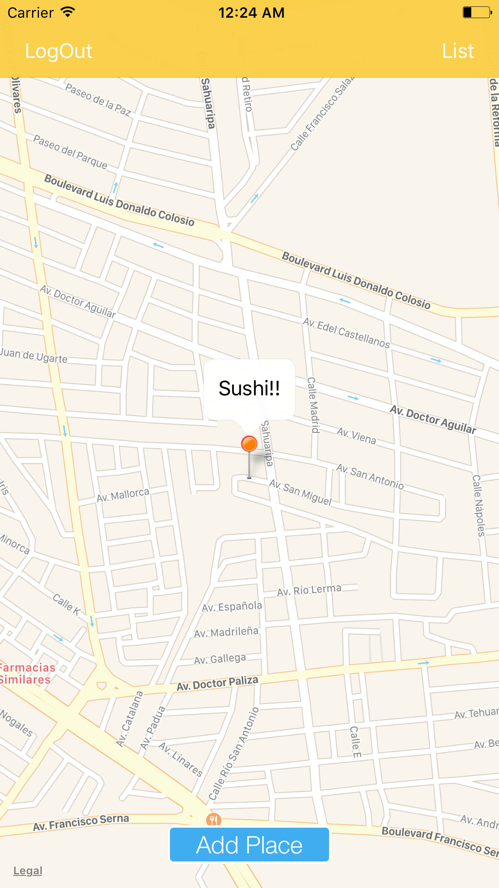
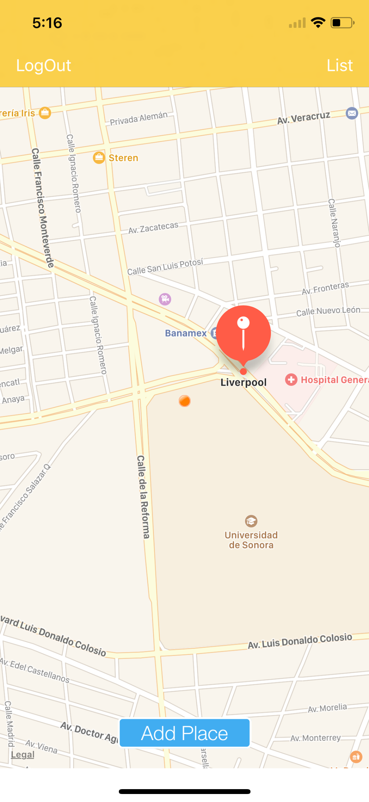

# MyPlaces
> iOS app to save places of interest in the city.

The purpose of this project is to show the basic functions of the following topics, and I hope you find it useful.

- @IBDesignable
- @IBInspectable
- Responsive UI
- TableView and Custom cell with xib files
- Real time Database with Firebase
- Firebase email Authentication
- Segues
- MVC structure

**Note: Do not forget to change the Bundle Identifier and open the `spaces.xcworkspace` instead spaces.xcodeproj to see the  pod artifacts (code/libraries) installed**

Iphone 6s Plus             |  Iphone X
:-------------------------:|:-------------------------:
  | 
 | 
    | 
   | 

## Requirements

- iOS 8.0+
- Xcode 9
- Swift 4
- Cocoapods 1.3.+

## Meta

Jonathan Guillermo – hernandezmarquina@gmail.com

Distributed under the MIT license.

[Github - hernandezmarquina](https://github.com/hernandezmarquina)